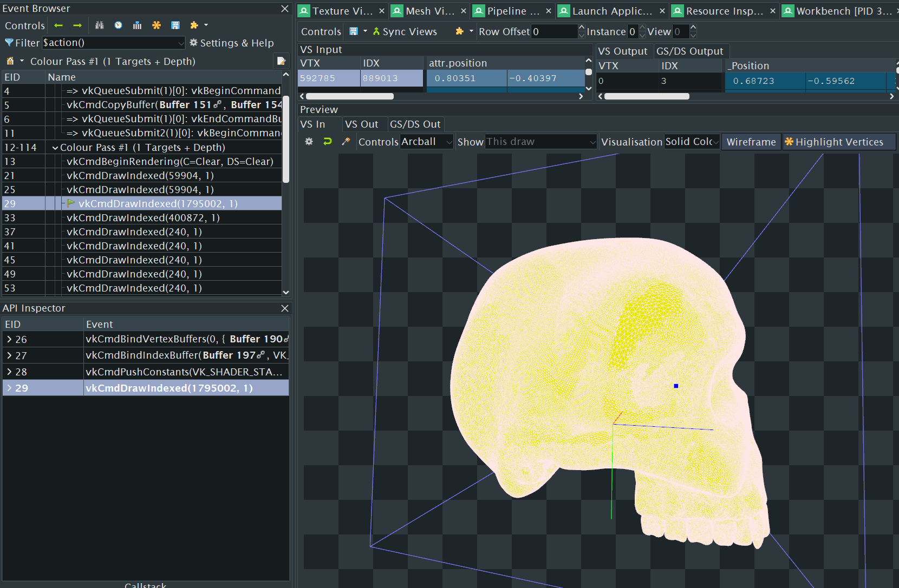
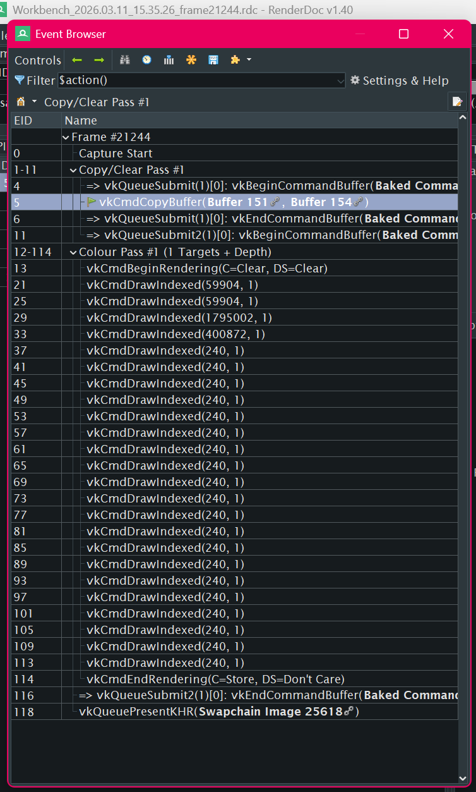

# 光エンジン Hikari Engine
English below.
自製レンダリングAPIとゲームエンジン実験プロジェクト。暇な瞬間だけに開発して３か月に作成しました。

<video controls width="500">
    <source src="https://github.com/proto-solarian/proto-solarian.github.io/raw/refs/heads/main/2025-10-16%2000-56-26.mp4" type="video/mp4">
    Your browser does not support the video tag.
</video>

ドクロもブレンダーのスカルプティングツールで自作しました。リトポロジーしていないのでバーテックスは大変多いのに、フレームの描画時間は役1msです。

上）レンダードックのキャプチャーによるレンダラーの構成。

## テクノロジー Technology
プログラミング言語
- C/C++
- Slang (HLSL)

利用ユーティリティライブラリー等
- Vulkan 1.3
- GLM
- 他に利用されておりません

## エンジン機能 Engine Features
- Wavefront .OBJファイルインポーター
- 三部構成
  - エンジンコア
  - アプリ（エディターの基盤）
  - 共有ライブラリー
- 構築可能なシーンオブジェクトヒエラルキー/トランスフォームツリー
- オブジェクトの行動をアプリ側でプログラム出来る
- エンティティコンポーネントシステム（ECS）の形にメモリ領域を定義している（例えば、アプリ側で作成された行動オブジェクトは連続メモリに書き込み、アップデート関数はフレーム毎に連続に呼び出しています）
- WindowsとAndroidに対応するように構築しています（現在Windowsのみに対応しています）

## レンダラー機能 Renderer Features
- プロメテウスという完全自製のVulkanレンダラー
- 単純な拡散反射シェーディング
- アプリ側で構築できるライティング
- 最適化しているフレームアップデート構成

## 次に実装する予定のエンジン機能 Upcoming Engine Features (Short-term)
- イメージインポート（AVIFかwebpを調査する予定だが、DCCワークフローをサポートする為にTIFFにする可能性が高い）
- 他の3Dモデルファイル形式をサポートする（FBX実装する可能性が高いが、理想的にGLTF/GLBをサポートしたい）
- アンドロイド対応
- ユーザーインプット読み込み

## 次に実装する予定のレンダラー機能 Upcoming Renderer Features　（Short-term）
- テキスチャー利用するシェーディング
- PBRシェーディング
- スカイボックス
- 透明なオブジェクトの描画
- グローバルイルミネーション
- シャドーマップ

## 後で実装する予定のエンジン機能 Upcoming Engine Features (Long-term)
- 仮想現実/空間レンダリングサポート
- シーンエディターインターフェース

## 後で実装する予定のレンダラー機能 Upcoming Renderer Features (Long-term)
- 未決定（現代的・次世代のレンダリング機能の実装する方法を複数実験する予定）

# Hikari Engine
A rendering API and game engine research project.

<video controls width="800">
    <source src="https://github.com/proto-solarian/proto-solarian.github.io/raw/refs/heads/main/2025-10-16%2000-56-26.mp4" type="video/mp4">
    Your browser does not support the video tag.
</video>

The skull was also built my yours truly with Blender's sculpting tools. It hasn't been retopologized so the vertex count is quite high, yet the renderer has no problem drawing every frame in ~1ms.

Above) The actual renderer's architecture as captured by RenderDoc

## Technologies
Languages:
- C/C++
- Slang (HLSL)

Utilities:
- Vulkan 1.3
- GLM
- No other APIs, Libraries, or Frameworks were used

## Engine Features
- Wavefront .OBJ file importer
- 3-Part Architecture:
  - Engine Core
  - App(Editor base)
  - Shared library
- Scene object hierarchy/composable transform tree
- Customizable object behaviors
- Entity-Component System (ECS) consideration for memory locality (i.e.: customized behaviors exist in contiguous memory and their Updates are called sequentially)
- Built with Windows and Android in mind, but currently only supports Windows

## Renderer Features
- A completely bespoke vulkan-based renderer called Prometheus
- Simple, diffuse shading
- App-side Lighting
- Highly performant frame updates

## Upcoming Engine Features (Short-term)
- Image importing (AVIF or Webp possible, but TIFF to support artist workflows)
- More mesh importing (FBX likely, GLTF/GLB ideal)
- Android support
- Input handling

## Upcoming Renderer Features　（Short-term）
- Texturing
- PBR Shading
- Skyboxes
- Transparent object drawing
- Global illumination
- Shadow mapping

## Upcoming Engine Features (Long-term)
- Virtual Reality/Spatial Rendering Support
- Scene editor interface

## Upcoming Renderer Features (Long-term)
- 未決定（現代的・次世代のレンダリング機能の実装する方法を複数実験する予定）
